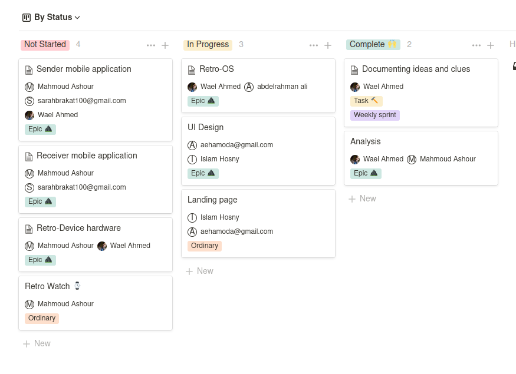

# Retrogram documentation
The starting point of retrogram docs/analysis

## Overview
Since the creation of smartphones (1994) people have dealt with a 2-D screen showing some frames. After many generations technology tends to 3-D screens or to be specific, visualizing objects in real life, like Virtual Reality, Augmented Reality, Mixed Reality, and the most charming, Hologram.
Using physics rules and math, a hologram can record an interference pattern that uses diffraction to reproduce a 3-D light field. Currently, hologram devices are sold at a high cost and using a lot of hardware extensions. Not all images can be visualized using most hologram devices.
By turning your smartphone into a hologram device, we are working on a new real hologram experience that anyone can have at an extremely low cost without a lot of hardware complications.
Retro-Device is a holographic device consisting of a screen, and a special-purpose operating system by us, Retro-OS, with Bluetooth and WiFi connection. With some physics rules and light field reflection upon using a special kind of plastic and glasses, any picture can be represented in our device.

## Distributing work
Through [notion](https://www.notion.so/1d720e2336ee4a488dcc9a11f003ef0c?v=c4031935ab1a489084d29a85f6ed0d9e), for example:  

